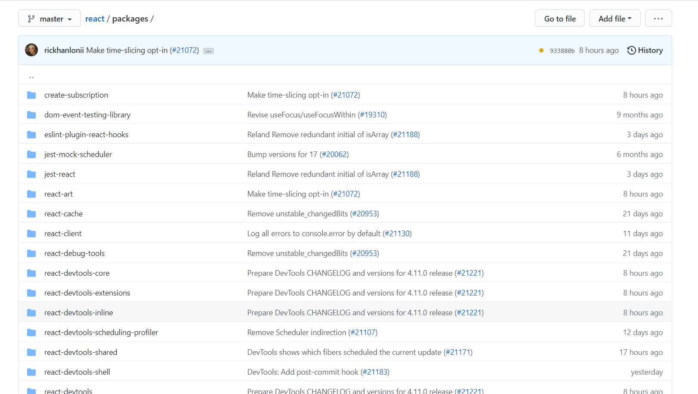

1. monorepo method - a new way to setup your projects - this method is being used by lot of projects , for example, babeljs, reactjs etc. they are starting to adopt it.
2. so, the concept of monorepo is, instead of having different packages in different repo with different folder structures, what you do is that, you put all your packages into a single repo. Taking the example of babeljs, there is a packages folder and under that, all the different packages of Babel come. So, I even looked up https://github.com/facebook/react, this is how it looks like.

3. And basically this is done by Babel (to be honest, at the time of writing, I don't know what is Babel) or React, by using a tool called yarn workspace.
4. firstly, what is the advantage of using yarn workspace - A) we can share dependencies across packages, B) we can also share code across multiple packages. (now I can understand why Ben was initially talking about yarn workspaces in Airbnb clone project, to share code between React & React Native project using Yarn workspaces. )
5. [yarn_workspace_project](my_yarn_workspace_project) from this point onwards, I am actually going to follow step by step and create a project to learn about Yarn workspaces, so the notes.md will be created in that project and I will share the link here - 
6. some advantages are: you can share dependencies across packages and apart from that, even code can be shared.
7. The way of demonstrating yarn workspaces, is to , create function in one package and use it in another package.
8. So, we went ahead and created 2 workspaces and cd'ed and yarn inited in both the workspaces.
9. When we install node packages from different workspaces, what happens is that, there is a single node modules folder at the root level of the project which contains all the dependencies.
10. Please note that, the way to add dependencies is to use: yarn add 'dependency', for example: yarn add graphql-yoga 

